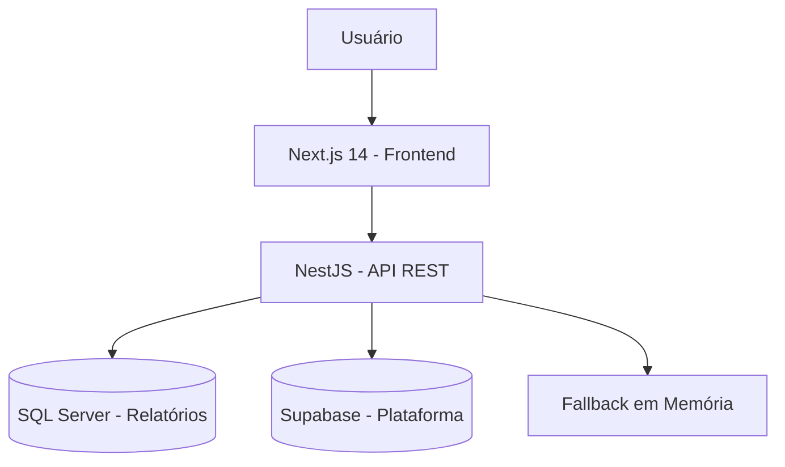

# ARQUITETURA.md — Arquitetura do Sistema

**Projeto:** Dashboard Power BI
**Atualizado em:** 2026-06-28
**Status:** Desenvolvimento (funcional parcial, abaixo do escopo V1)

---

## 1. Visão Geral

O Dashboard Power BI é uma plataforma web interna de relatórios e BI que centraliza relatórios de um sistema desktop em uma interface web segura, com dashboards interativos e controle de acesso por setor. A plataforma destina-se a usuários internos de uma organização que precisam visualizar, filtrar e exportar relatórios provenientes de um SQL Server corporativo, com perfis de acesso diferenciados (Visualizador, Downloader, Administrador).

O sistema está em estado funcional parcial: entrega autenticação, dashboard, relatórios, administração e BI básico, mas ainda não representa o V1 completo descrito no escopo original.

---

## 2. Stack Tecnológica Identificada

### Backend

- **Linguagem:** TypeScript (strict)
- **Framework:** NestJS 10
- **ORM:** Nenhum ORM ativo (Prisma não implementado); acesso direto via `mssql` e `@supabase/supabase-js`
- **Autenticação:** JWT (access token + refresh token), `bcrypt`, 2FA/TOTP com `otplib`
- **Testes:** Jest, Supertest

### Frontend

- **Linguagem:** TypeScript (strict)
- **Framework:** Next.js 14 com App Router
- **UI library:** Tailwind CSS, componentes locais em `apps/web/src/components`
- **Gráficos:** Recharts (linha, barra, pizza, área)
- **Drag-and-drop:** `@dnd-kit/core`, `@dnd-kit/sortable`, `@dnd-kit/utilities`
- **Data fetching:** `@tanstack/react-query`
- **Testes:** Jest, Testing Library

### Banco de Dados

- **Banco principal (plataforma):** Supabase (PostgreSQL gerenciado) — persistência de usuários, grupos, permissões, auditoria, settings, dashboards, exportações, notificações
- **Banco externo (relatórios):** SQL Server via `mssql` — origem de leitura para relatórios e KPIs
- **ORM / Query Builder:** Nenhum; queries diretas parametrizadas
- **Migrations:** Supabase migrations em `supabase/migrations/` (8 arquivos)
- **Seeds:** Setores padrão e configurações iniciais embutidos nas migrations

### Infraestrutura

- **Monorepo:** pnpm workspaces
- **Docker:** Docker Compose para desenvolvimento e produção
- **CI/CD:** GitHub Actions (deploy para VPS)
- **Observabilidade:** Healthcheck em `/health` e `/health/sql`; NÃO IDENTIFICADO sistema de monitoramento/observabilidade estruturado
- **Redis:** Presente na infraestrutura Docker, mas não é dependência funcional da aplicação

---

## 3. Estrutura de Pastas

```text
/
├── apps/
│   ├── api/                 # API NestJS (backend)
│   │   └── src/
│   │       ├── admin/       # Módulo administrativo (users, groups, dashboard)
│   │       ├── audit/       # Módulo de auditoria
│   │       ├── auth/        # Módulo de autenticação (login, JWT, 2FA, reset)
│   │       ├── common/      # Módulo comum (middleware CSRF, utils)
│   │       ├── health/      # Healthchecks da API e SQL Server
│   │       ├── permissions/ # Módulo de permissões granulares
│   │       ├── platform/    # Módulo de plataforma (dashboard, dashboards, exports, notifications, settings)
│   │       ├── reports/     # Módulo de relatórios (catálogo, execução, admin, favoritos)
│   │       ├── sql-server/  # Camada de acesso ao SQL Server
│   │       └── validation-test/ # Módulo de validação (testes)
│   └── web/                 # Web Next.js (frontend)
│       └── src/
│           ├── app/         # App Router (páginas e rotas)
│           ├── components/  # Componentes React (auth, admin, charts, dashboard, reports, etc.)
│           └── lib/         # Clients HTTP e utilitários (admin-api, platform-api, reports-api, auth)
├── packages/
│   ├── shared/              # Reservado para contratos/utilitários compartilhados
│   └── ui/                  # Reservado para componentes compartilhados
├── docs/                    # Documentação técnica e análise de escopo
├── infra/
│   ├── docker/              # Dockerfiles e docker-compose (dev, demo, prod)
│   └── env/                 # Exemplos de variáveis de ambiente
├── scripts/                 # Scripts de validação estrutural
├── supabase/
│   └── migrations/          # 8 migrations SQL do Supabase
└── .github/
    └── workflows/           # CI/CD (deploy VPS)
```

---

## 4. Arquitetura Geral

O sistema segue o estilo **SPA + API** (monolito modular):

- Frontend Next.js (SSR/SSG + App Router) como SPA autenticado
- Backend NestJS como API REST modular
- Monorepo pnpm com duas aplicações principais



**Topologia real atual:**

```text
apps/web -> apps/api -> SQL Server
                    \-> Supabase
                    \-> memoria em partes do dominio
```

A API NestJS é a fonte oficial de todos os fluxos autenticados. O frontend não acessa Supabase diretamente. Quando `SUPABASE_URL` e `SUPABASE_SERVICE_ROLE_KEY` não estão configurados, a API usa fallback em memória para parte do domínio.

---

## 5. Módulos do Sistema

### Auth

- **Responsabilidade:** Login, refresh, logout, recuperação de senha, perfil do usuário, 2FA/TOTP, rate limiting
- **Principais arquivos:** `apps/api/src/auth/*`, `apps/web/src/components/auth/*`, `apps/web/src/lib/auth/session.ts`
- **Funcionalidades:** Login com JWT + refresh token, reset de senha com token temporário, `GET /auth/me`, `PATCH /auth/me/password`, 2FA/TOTP (setup, verify, disable, login), rate limiting de tentativas, CSRF middleware
- **Dependências:** `bcrypt`, `otplib`, `@supabase/supabase-js`
- **Status:** Parcial — 2FA/TOTP implementado e opcional; hardening final pendente (2FA obrigatório para admins, blacklist de tokens)

### Admin Users

- **Responsabilidade:** CRUD de usuários, desativação, reset de senha administrativo
- **Principais arquivos:** `apps/api/src/admin/users/*`, `apps/web/src/components/admin/admin-users.tsx`
- **Funcionalidades:** Listagem paginada com busca, filtros por status/role/setor, criação, edição, desativação (soft delete), reset de senha
- **Status:** Funcional

### Admin Groups

- **Responsabilidade:** CRUD de grupos de usuários
- **Principais arquivos:** `apps/api/src/admin/groups/*`, `apps/web/src/components/admin/admin-groups.tsx`
- **Funcionalidades:** Listagem, criação, edição, exclusão de grupos com roles e setores
- **Status:** Funcional

### Permissions

- **Responsabilidade:** Permissões granulares por recurso e ação, auditoria de mutações
- **Principais arquivos:** `apps/api/src/permissions/*`, `apps/web/src/components/admin/admin-permissions.tsx`
- **Funcionalidades:** CRUD de permissões (code, name, description, resource, action), auditoria em create/update/delete
- **Status:** Parcial — herança via grupos e guard combinado JWT + role + permission pendentes

### Reports

- **Responsabilidade:** Catálogo, visualização, execução, gestão administrativa, favoritos e exportação de relatórios
- **Principais arquivos:** `apps/api/src/reports/*`, `apps/web/src/components/reports/*`, `apps/web/src/components/admin/admin-reports.tsx`
- **Funcionalidades:** Catálogo por setor com busca, visualização inline com parâmetros, filtros avançados, CRUD admin de definições, validação de fonte SQL, favoritos, exportação (PDF/XLSX/CSV/JSON) com pipeline, fila, histórico e download autenticado
- **Dependências:** `apps/api/src/sql-server/*` (acesso ao SQL Server)
- **Status:** Parcial — BullMQ/Redis implementados com fallback em memória; storage S3 pendente

### Dashboard

- **Responsabilidade:** Dashboard home com KPIs, drill-down, dashboards personalizados, editor visual
- **Principais arquivos:** `apps/api/src/platform/dashboard/*`, `apps/api/src/platform/dashboards/*`, `apps/web/src/components/dashboard/*`, `apps/web/src/components/charts/*`
- **Funcionalidades:** `GET /dashboard/home` (payload consolidado), `GET /dashboard/kpis/:kpiId/drilldown`, `GET /dashboard/kpis/:kpiId/history`, CRUD de dashboards personalizados, widgets (KPI, gráfico, tabela), reordenação drag-and-drop via `@dnd-kit/sortable`, charts Recharts (bar, line, pie, area)
- **Status:** Parcial — drill-down apenas por sector, editor visual mínimo (redimensionamento e paleta pendentes)

### Notifications

- **Responsabilidade:** Central de notificações do usuário
- **Principais arquivos:** `apps/api/src/platform/notifications/*`, `apps/web/src/components/notifications/*`
- **Funcionalidades:** Listagem, marcar como lida, filtros por tipo
- **Status:** Funcional (simples frente ao PDF)

### Exports

- **Responsabilidade:** Pipeline de exportação de relatórios
- **Principais arquivos:** `apps/api/src/platform/exports/*`, `apps/web/src/components/exports/*`
- **Funcionalidades:** Solicitação de exportação (PDF/XLSX/CSV/JSON), fila em memória, worker, histórico, download autenticado, notificação ao concluir, auditoria, expiração automática (7 dias)
- **Status:** Parcial — sem BullMQ/Redis, sem storage S3

### Audit

- **Responsabilidade:** Logs de auditoria de ações administrativas
- **Principais arquivos:** `apps/api/src/audit/*`, `apps/web/src/components/admin/admin-audit.tsx`
- **Funcionalidades:** Listagem com filtros (usuário, ação, recurso, período), detalhe (quem, quando, o que, IP), eventos de exports, permissões e settings
- **Status:** Funcional (hardening final pendente)

### Settings

- **Responsabilidade:** Configurações do sistema
- **Principais arquivos:** `apps/api/src/platform/settings/*`, `apps/web/src/components/admin/admin-settings.tsx`
- **Funcionalidades:** Listagem, `PATCH /admin/settings/:key` com auditoria, edição de valores não sensíveis
- **Status:** Funcional (abaixo da profundidade do PDF)

### SQL Server

- **Responsabilidade:** Camada de acesso ao SQL Server externo (somente leitura)
- **Principais arquivos:** `apps/api/src/sql-server/*`
- **Funcionalidades:** Conexão via pool com `mssql`, queries parametrizadas, validação de identificadores, proteção contra SQL injection, healthcheck
- **Status:** Parcial — cache, cron, monitoramento e observabilidade pendentes

---

## 6. Funcionalidades Existentes

| Funcionalidade               | Módulo        | Status     | Evidência no repositório                                                      |
| ---------------------------- | ------------- | ---------- | ----------------------------------------------------------------------------- |
| Login com JWT                | Auth          | Confirmado | `apps/api/src/auth/auth.controller.ts`                                        |
| Refresh token                | Auth          | Confirmado | `apps/api/src/auth/auth.controller.ts`                                        |
| Logout                       | Auth          | Confirmado | `apps/api/src/auth/auth.controller.ts`                                        |
| Recuperação de senha         | Auth          | Confirmado | `apps/api/src/auth/services/password-reset.service.ts`                        |
| Perfil do usuário            | Auth          | Confirmado | `apps/api/src/auth/auth.controller.ts` — `GET /auth/me`                       |
| Alteração de senha           | Auth          | Confirmado | `apps/api/src/auth/auth.controller.ts` — `PATCH /auth/me/password`            |
| 2FA/TOTP                     | Auth          | Confirmado | `apps/api/src/auth/services/totp.service.ts` — setup, verify, disable, login  |
| Rate limiting no login       | Auth          | Confirmado | `apps/api/src/auth/services/login-attempts.service.ts`                        |
| CSRF middleware              | Auth          | Confirmado | `apps/api/src/common/middleware/csrf.middleware.ts`                           |
| Headers de segurança         | Auth          | Confirmado | CSP, HSTS, X-Frame-Options, X-Content-Type-Options, Referrer-Policy           |
| Dashboard home com KPIs      | Dashboard     | Confirmado | `apps/api/src/platform/dashboard/*` — `GET /dashboard/home`                   |
| Drill-down de KPI            | Dashboard     | Confirmado | `GET /dashboard/kpis/:kpiId/drilldown`                                        |
| Histórico de KPI             | Dashboard     | Confirmado | `GET /dashboard/kpis/:kpiId/history`                                          |
| Gráficos Recharts            | Dashboard     | Confirmado | `apps/web/src/components/charts/*`                                            |
| Dashboards personalizados    | Dashboard     | Confirmado | `apps/api/src/platform/dashboards/*`                                          |
| Editor visual (mínimo)       | Dashboard     | Confirmado | `apps/web/src/components/dashboard/dashboard-detail.tsx` — DnD com `@dnd-kit` |
| Catálogo de relatórios       | Reports       | Confirmado | `apps/api/src/reports/reports.controller.ts`                                  |
| Visualização inline          | Reports       | Confirmado | `apps/web/src/components/reports/report-detail.tsx`                           |
| Filtros avançados            | Reports       | Confirmado | `apps/web/src/components/reports/report-advanced-filters.tsx`                 |
| Gestão admin de relatórios   | Reports       | Confirmado | `apps/api/src/reports/report-definitions.admin.controller.ts`                 |
| Validação de fonte SQL       | Reports       | Confirmado | `POST /admin/reports/validate`                                                |
| Favoritos de relatórios      | Reports       | Confirmado | `apps/api/src/reports/report-favorites.service.ts`                            |
| Exportação PDF/XLSX/CSV/JSON | Exports       | Confirmado | `apps/api/src/platform/exports/*`                                             |
| Histórico de exportações     | Exports       | Confirmado | `apps/web/src/components/exports/exports-list.tsx`                            |
| Download autenticado         | Exports       | Confirmado | `apps/api/src/platform/exports/*`                                             |
| CRUD de usuários             | Admin Users   | Confirmado | `apps/api/src/admin/users/*`                                                  |
| CRUD de grupos               | Admin Groups  | Confirmado | `apps/api/src/admin/groups/*`                                                 |
| CRUD de permissões           | Permissions   | Confirmado | `apps/api/src/permissions/*`                                                  |
| Auditoria com filtros        | Audit         | Confirmado | `apps/api/src/audit/*`                                                        |
| Configurações do sistema     | Settings      | Confirmado | `apps/api/src/platform/settings/*`                                            |
| Dashboard administrativo     | Admin         | Confirmado | `apps/api/src/admin/dashboard/*` — `GET /admin/dashboard`                     |
| Notificações                 | Notifications | Confirmado | `apps/api/src/platform/notifications/*`                                       |
| Healthcheck API + SQL        | SQL Server    | Confirmado | `apps/api/src/health/*`                                                       |
| Swagger/OpenAPI              | Common        | Confirmado | `http://localhost:3001/docs`                                                  |
| Sessão em sessionStorage     | Auth          | Confirmado | `apps/web/src/lib/auth/session.ts`                                            |
| React Query                  | Frontend      | Confirmado | `apps/web/src/lib/react-query/*`                                              |

---

## 7. Funcionalidades Pendentes ou A Confirmar

| Funcionalidade                          | Motivo da pendência                   | Próxima ação                                               |
| --------------------------------------- | ------------------------------------- | ---------------------------------------------------------- |
| Drill-down multi-dimensão               | Apenas sector implementado            | Adicionar dimensões de tempo, produto, região              |
| Editor visual completo                  | Apenas reordenação implementada       | Redimensionamento, paleta de widgets, canvas livre         |
| BullMQ + Redis                          | Implementados com fallback em memória | Storage S3 pendente                                        |
| Prisma ORM                              | Não implementado                      | Avaliar se será adotado ou se Supabase direto é suficiente |
| Cache de queries SQL Server             | Não implementado                      | Implementar cache com TTL configurável                     |
| Cron de refresh                         | Não implementado                      | Agendar refresh de relatórios e KPIs                       |
| Monitoramento de queries                | Não implementado                      | Logs estruturados de tempo de execução                     |
| Storage S3 para exports                 | Não implementado                      | Avaliar necessidade de storage externo                     |
| Herança de permissões via grupos        | Não implementada                      | Usuário herda permissões dos grupos                        |
| Guard combinado JWT + role + permission | Apenas JWT + role                     | Adicionar validação de permissão granular no guard         |
| Blacklist de tokens revogados           | Não implementado                      | Estratégia de invalidação em massa                         |
| Hardening final de sessão               | Parcial                               | Estratégia final de invalidação e timeout                  |
| Testes E2E (Playwright)                 | Não configurados                      | Priorizar fluxos críticos: login, relatório, exportação    |

---

## 8. Fluxos Principais

### Login

- **Entrada:** Email + senha (ou código TOTP se 2FA ativo)
- **Processamento:** `POST /auth/login` → valida credenciais com `bcrypt` → verifica rate limit → se 2FA ativo, retorna `requiresTwoFactor: true` + `tempToken` → `POST /auth/totp/login` com código → emite JWT access token (15min) + refresh token (7 dias)
- **Saída:** Tokens armazenados em `sessionStorage` no frontend
- **Arquivos:** `apps/api/src/auth/auth.controller.ts`, `apps/web/src/components/auth/login-form.tsx`, `apps/web/src/lib/auth/session.ts`
- **Erros possíveis:** Credenciais inválidas (401), conta inativa (403), rate limit (429), TOTP inválido (401)

### Dashboard Home

- **Entrada:** Requisição autenticada
- **Processamento:** `GET /dashboard/home` → agrega KPIs por setor do usuário → monta payload com resumo, KPIs e séries para charts
- **Saída:** Payload consolidado renderizado com Recharts (BarChart, LineChart, PieChart, AreaChart)
- **Arquivos:** `apps/api/src/platform/dashboard/*`, `apps/web/src/components/dashboard/dashboard-home.tsx`, `apps/web/src/components/charts/*`
- **Erros possíveis:** 401 (token expirado → refresh automático único), 500 (erro de agregação)

### Drill-down de KPI

- **Entrada:** KPI ID selecionado pelo clique no card
- **Processamento:** `GET /dashboard/kpis/:kpiId/drilldown` → retorna série e tabela de comparação; `GET /dashboard/kpis/:kpiId/history` → retorna série histórica de 12 meses
- **Saída:** Modal/página com gráfico de evolução e tabela comparativa
- **Arquivos:** `apps/api/src/platform/dashboard/*`, `apps/web/src/components/dashboard/dashboard-detail.tsx`
- **Erros possíveis:** 404 (KPI não encontrado), 401

### Execução de Relatório

- **Entrada:** Relatório ID + parâmetros dinâmicos
- **Processamento:** `POST /reports/:id/execute` → valida parâmetros → monta query parametrizada → executa no SQL Server via `mssql` → retorna resultados em tabela
- **Saída:** Grid de dados no frontend
- **Arquivos:** `apps/api/src/reports/reports.controller.ts`, `apps/api/src/sql-server/sql-server.service.ts`, `apps/web/src/components/reports/report-detail.tsx`
- **Erros possíveis:** 400 (parâmetros inválidos), 403 (sem permissão), 500 (erro SQL Server), timeout

### Exportação de Relatório

- **Entrada:** Relatório ID + formato (PDF/XLSX/CSV/JSON) + parâmetros
- **Processamento:** `POST /exports` → cria job na fila → worker processa → gera arquivo → notifica usuário → registra auditoria
- **Saída:** Arquivo disponível para download autenticado; histórico atualizado
- **Arquivos:** `apps/api/src/platform/exports/*`, `apps/web/src/components/exports/exports-list.tsx`, `apps/web/src/components/reports/report-detail.tsx`
- **Erros possíveis:** 400 (formato inválido), 500 (erro de geração), job expirado

### CRUD Administrativo de Usuários

- **Entrada:** Dados do usuário (email, roles, setores, status)
- **Processamento:** `POST /admin/users` → valida email único → hasha senha com `bcrypt` → persiste via repositório híbrido (Supabase ou memória)
- **Saída:** Usuário criado/editado/desativado
- **Arquivos:** `apps/api/src/admin/users/*`, `apps/web/src/components/admin/admin-users.tsx`
- **Erros possíveis:** 409 (email duplicado), 403 (sem permissão admin), 400 (validação)

---

## 9. Integrações Externas

| Integração            | Finalidade                                                                                                        | Onde é usada                             | Status      | Observações                                                                          |
| --------------------- | ----------------------------------------------------------------------------------------------------------------- | ---------------------------------------- | ----------- | ------------------------------------------------------------------------------------ |
| SQL Server (`mssql`)  | Origem de leitura para relatórios e KPIs                                                                          | `apps/api/src/sql-server/*`              | Funcional   | Somente SELECT e EXEC de SPs; queries parametrizadas                                 |
| Supabase (PostgreSQL) | Persistência de plataforma (usuários, grupos, permissões, auditoria, settings, dashboards, exports, notificações) | `apps/api/src/supabase/*` e repositórios | Funcional   | Service role key no backend; fallback em memória quando não configurado              |
| SMTP                  | Envio de emails (recuperação de senha, notificações)                                                              | Configurado via settings                 | A CONFIRMAR | Configuração `smtp_host`/`smtp_port` em `system_settings`; não confirmado envio real |

---

## 10. Segurança e Autenticação

### Modelo de autenticação

- JWT access token (curta duração) + refresh token (7 dias)
- Senhas com `bcrypt` (salt rounds >= 12)
- 2FA/TOTP opcional via `otplib` (Authenticator App)
- Rate limiting no login (5 tentativas por 15 min por IP)

### Autorização/perfis

- Roles fixas: `visualizador`, `downloader`, `admin`
- Setores: financeiro, RH, vendas, operações, TI
- Grupos de usuários com roles e setores agregados
- Permissões granulares: `resource:scope:action`
- Guards: JWT + role (guard combinado com permissão granular pendente)

### Proteção de rotas

- `JwtAuthGuard` em todas as rotas autenticadas
- `RolesGuard` para rotas administrativas
- Middleware CSRF: double-submit pattern (cookie `csrf-token` com `httpOnly: false` + `sameSite: 'lax'` + header `x-csrf-token` no frontend)
- CORS com `credentials: true` e origins configuráveis via `CORS_ORIGINS`
- Rotas de auth (login, refresh, logout, TOTP, forgot/reset password) excluídas do CSRF
- Sessão web em `sessionStorage` (não `localStorage`)

### Headers de segurança ativos

- Content-Security-Policy (CSP)
- HSTS (produção)
- X-Frame-Options
- X-Content-Type-Options
- Referrer-Policy
- Permissions-Policy

### Validação de entrada

- DTOs com `class-validator` no backend
- Validação de identificadores SQL contra whitelist
- Queries parametrizadas obrigatórias no SQL Server

### Riscos identificados

- 2FA/TOTP não é obrigatório para admins (opcional)
- Blacklist de tokens revogados não implementada
- Parte do domínio ainda usa fallback em memória (sem persistência)
- Herança de permissões via grupos não implementada

---

## 11. Build, Execução e Testes

```bash
# Instalação
pnpm install

# Desenvolvimento
pnpm dev:api          # API em http://localhost:3001
pnpm dev:web          # Web em http://localhost:3000
pnpm docker:dev       # Ambos via Docker Compose

# Validação estrutural
pnpm verify:workspace
pnpm verify:docker
pnpm verify:docs

# Qualidade
pnpm lint
pnpm format:check
pnpm typecheck
pnpm quality          # Suite completa de qualidade

# Testes
pnpm test
pnpm --filter @dashboard-power-bi/api test
pnpm --filter @dashboard-power-bi/web test
pnpm test:e2e

# Build
pnpm build
pnpm --filter @dashboard-power-bi/api build
pnpm --filter @dashboard-power-bi/web build

# Produção
pnpm docker:prod
```

**URLs locais:**

```text
Web:          http://localhost:3000
Design system: http://localhost:3000/design-system
API:          http://localhost:3001
Healthcheck:  http://localhost:3001/health
SQL Health:   http://localhost:3001/health/sql
Swagger:      http://localhost:3001/docs
```

---

## 12. Pontos de Atenção Técnica

- **Débitos técnicos:**
  - Storage S3 para exports pendente (BullMQ/Redis já implementados com fallback em memória)
  - Prisma não adotado (acesso direto ao Supabase)
  - Cache de queries SQL Server ausente
  - Testes E2E (Playwright) não configurados
  - Herança de permissões via grupos pendente
  - Editor visual de dashboards apenas com reordenação

- **Partes frágeis:**
  - Fallback em memória pode perder dados ao reiniciar a API
  - Dependência operacional do Supabase no backend sem alternativa
  - `pnpm typecheck` pode falhar no web sem artefatos de build do Next.js (`.next/types`)

- **Falta de testes:**
  - Cobertura de novos módulos (permissions, audit) incompleta
  - Testes E2E críticos ausentes (login, relatório, exportação)

- **Módulos acoplados:**
  - `PlatformModule` concentra dashboard, dashboards, exports, notifications e settings

- **Riscos de escala:**
  - BullMQ + Redis implementados, mas fallback em memória não suporta múltiplas instâncias
  - Sem cache de queries, cada execução de relatório hita o SQL Server

- **Riscos de segurança:**
  - 2FA opcional (não obrigatório para admins — pendente DT-001)
  - Sem blacklist de tokens revogados
  - Sem estratégia de invalidação em massa de sessões

---

## 13. Decisões Arquiteturais

| Data       | Decisão                                                         | Motivo                                              | Impacto                                                                         |
| ---------- | --------------------------------------------------------------- | --------------------------------------------------- | ------------------------------------------------------------------------------- |
| 2026-06-04 | Monorepo pnpm com apps/api e apps/web                           | Organização e compartilhamento de configs           | Estrutura base do projeto                                                       |
| 2026-06-04 | NestJS como API backend                                         | Framework modular TypeScript com DI                 | `ADR-0003` em `docs/decisions/`                                                 |
| 2026-06-04 | Next.js 14 App Router como frontend                             | SSR/SSG, SEO, ecossistema React                     | `ADR-0004` em `docs/decisions/`                                                 |
| 2026-06-04 | Docker Compose para dev e prod                                  | Padronização de ambiente                            | `ADR-0006` em `docs/decisions/`                                                 |
| 2026-06-05 | Centralização na API como fonte oficial dos fluxos autenticados | Eliminar dependência direta do frontend no Supabase | Frontend passou a consumir apenas a API                                         |
| 2026-06-05 | Sessão web em sessionStorage (não localStorage)                 | Segurança de sessão                                 | Migração de legado + refresh automático único em 401                            |
| 2026-06-05 | Supabase como persistência de plataforma                        | PostgreSQL gerenciado com RLS                       | Repositórios híbridos (memória + Supabase)                                      |
| 2026-06-05 | Recharts para gráficos                                          | Biblioteca React para charts interativos            | Componentes reutilizáveis em `components/charts/`                               |
| 2026-06-05 | React Query para data fetching                                  | Cache, sync e refetch automático                    | `@tanstack/react-query` integrado ao layout                                     |
| 2026-06-10 | `@dnd-kit/sortable` para editor visual                          | Drag-and-drop acessível e modular                   | Reordenação de widgets no dashboard                                             |
| 2026-06-10 | 2FA/TOTP com `otplib`                                           | Segurança de autenticação para admins               | Setup, verify, disable e login TOTP                                             |
| 2026-06-28 | Consolidação de governança na raiz do repositório               | Fontes canônicas únicas de documentação             | Criação de ARQUITETURA.md, BANCO_DADOS.md, ESCOPO.md, CONTEXTO.md, RELATORIO.md |
