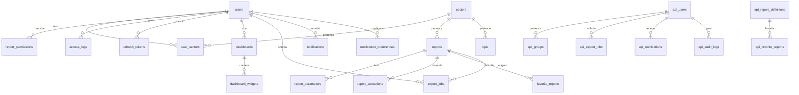

# BANCO_DADOS.md — Arquitetura de Banco de Dados

**Projeto:** Dashboard Power BI
**Atualizado em:** 2026-06-28
**Banco identificado:** Supabase (PostgreSQL gerenciado) + SQL Server externo (somente leitura)

---

## 1. Visão Geral

O sistema utiliza duas fontes de dados distintas:

1. **Supabase (PostgreSQL gerenciado)** — banco principal da plataforma, armazena usuários, grupos, permissões, auditoria, settings, dashboards, exportações, notificações, definições de relatórios e favoritos. Acessado via service role key no backend NestJS com bypass de RLS.
2. **SQL Server externo** — origem de leitura para relatórios e KPIs. Acessado via `mssql` com queries parametrizadas. Somente SELECT e EXEC de stored procedures permitidos.

A estratégia de persistência é híbrida: quando `SUPABASE_URL` e `SUPABASE_SERVICE_ROLE_KEY` estão configurados, a API usa Supabase; caso contrário, usa fallback em memória para parte do domínio.

---

## 2. Tecnologia e Ferramentas

- **Banco de plataforma:** Supabase (PostgreSQL 15+)
- **Banco de relatórios:** SQL Server (versão a confirmar no ambiente do cliente)
- **ORM:** Nenhum (Prisma não implementado)
- **Client PostgreSQL:** `@supabase/supabase-js` (service role)
- **Client SQL Server:** `mssql` (pool de conexões)
- **Migration tool:** Supabase CLI (`supabase/migrations/`)
- **Seeds:** Setores padrão e configurações iniciais embutidos nas migrations
- **Ambiente local:** Docker Compose com Supabase local ou Supabase cloud
- **Ambiente produção:** Supabase cloud + SQL Server do cliente (rede interna ou VPN)
- **String de conexão:** `NÃO DOCUMENTAR VALORES SENSÍVEIS` — ver `infra/env/.env.example`

---

## 3. Localização dos Arquivos de Banco

| Tipo                     | Caminho                                                       | Observação                          |
| ------------------------ | ------------------------------------------------------------- | ----------------------------------- |
| Migrations               | `supabase/migrations/`                                        | 8 arquivos SQL                      |
| Configuração Supabase    | `apps/api/src/supabase/supabase.service.ts`                   | Cliente service role                |
| Configuração SQL Server  | `apps/api/src/sql-server/sql-server.service.ts`               | Pool de conexões                    |
| Query builder SQL Server | `apps/api/src/sql-server/sql-query-builder.ts`                | Montagem segura de queries          |
| Repositórios (API)       | `apps/api/src/*/repositories/`                                | Padrão híbrido (memória + Supabase) |
| Env examples             | `infra/env/.env.example`, `infra/env/.env.production.example` | Variáveis de conexão                |

---

## 4. Modelo Entidade-Relacionamento



> **Observação:** O diagrama acima mostra o modelo completo das migrations. As tabelas `api_*` são as tabelas de runtime da API NestJS (acessadas via service role). As tabelas sem prefixo `api_` são do modelo original do Supabase (com RLS para acesso direto do frontend, não usado no runtime atual).

---

## 5. Tabelas / Coleções

### 5.1. Tabelas do modelo original (migrations 001-003)

---

### `users`

**Finalidade:** Usuários da plataforma com email, senha hash e status
**Arquivo/model relacionado:** `supabase/migrations/20260604203236_001_create_auth_and_permissions.sql`
**Migration de origem:** 001

| Campo          | Tipo        | Obrigatório | Default             | Chave  | Observações               |
| -------------- | ----------- | ----------- | ------------------- | ------ | ------------------------- |
| id             | UUID        | Sim         | `gen_random_uuid()` | PK     |                           |
| email          | TEXT        | Sim         | —                   | UNIQUE | Índice `idx_users_email`  |
| password_hash  | TEXT        | Sim         | —                   | —      | bcrypt, nunca retornado   |
| first_name     | TEXT        | Não         | —                   | —      |                           |
| last_name      | TEXT        | Não         | —                   | —      |                           |
| is_active      | BOOLEAN     | Não         | `true`              | —      | Índice `idx_users_active` |
| is_mfa_enabled | BOOLEAN     | Não         | `false`             | —      | 2FA/TOTP                  |
| mfa_secret     | TEXT        | Não         | —                   | —      | Secret do TOTP            |
| last_login_at  | TIMESTAMPTZ | Não         | —                   | —      |                           |
| created_at     | TIMESTAMPTZ | Não         | `now()`             | —      |                           |
| updated_at     | TIMESTAMPTZ | Não         | `now()`             | —      |                           |
| deactivated_at | TIMESTAMPTZ | Não         | —                   | —      | Soft delete               |

**Relacionamentos:**

- `user_sectors.user_id` → `users.id` (CASCADE)
- `report_permissions.user_id` → `users.id` (CASCADE)
- `access_logs.user_id` → `users.id` (SET NULL)
- `refresh_tokens.user_id` → `users.id` (CASCADE)

**RLS:** Habilitado. Políticas: próprio perfil (SELECT/UPDATE), admin gerencia tudo.

---

### `sectors`

**Finalidade:** Setores da organização (financeiro, RH, vendas, etc)
**Arquivo/model relacionado:** `001_create_auth_and_permissions.sql`
**Migration de origem:** 001

| Campo       | Tipo        | Obrigatório | Default             | Chave  | Observações            |
| ----------- | ----------- | ----------- | ------------------- | ------ | ---------------------- |
| id          | UUID        | Sim         | `gen_random_uuid()` | PK     |                        |
| code        | TEXT        | Sim         | —                   | UNIQUE | Ex: `financeiro`, `rh` |
| name        | TEXT        | Sim         | —                   | —      |                        |
| description | TEXT        | Não         | —                   | —      |                        |
| is_active   | BOOLEAN     | Não         | `true`              | —      |                        |
| created_at  | TIMESTAMPTZ | Não         | `now()`             | —      |                        |

**Seeds:** financeiro, RH, vendas, operações, TI

**RLS:** Habilitado.

---

### `user_sectors`

**Finalidade:** Associação usuário-setor com role
**Migration de origem:** 001

| Campo       | Tipo        | Obrigatório | Default             | Chave        | Observações |
| ----------- | ----------- | ----------- | ------------------- | ------------ | ----------- |
| id          | UUID        | Sim         | `gen_random_uuid()` | PK           |             |
| user_id     | UUID        | Sim         | —                   | FK → users   | CASCADE     |
| sector_id   | UUID        | Sim         | —                   | FK → sectors | CASCADE     |
| role        | user_role   | Sim         | `visualizador`      | —            | ENUM        |
| assigned_at | TIMESTAMPTZ | Não         | `now()`             | —            |             |

**Constraints:** `UNIQUE(user_id, sector_id)`
**Índices:** `idx_user_sectors_user`, `idx_user_sectors_sector`
**RLS:** Habilitado.

---

### `report_permissions`

**Finalidade:** Permissões por relatório e usuário
**Migration de origem:** 001

| Campo       | Tipo        | Obrigatório | Default             | Chave      | Observações            |
| ----------- | ----------- | ----------- | ------------------- | ---------- | ---------------------- |
| id          | UUID        | Sim         | `gen_random_uuid()` | PK         |                        |
| user_id     | UUID        | Sim         | —                   | FK → users | CASCADE                |
| report_id   | TEXT        | Sim         | —                   | —          | ID lógico do relatório |
| can_view    | BOOLEAN     | Não         | `true`              | —          |                        |
| can_export  | BOOLEAN     | Não         | `false`             | —          |                        |
| assigned_at | TIMESTAMPTZ | Não         | `now()`             | —          |                        |

**Constraints:** `UNIQUE(user_id, report_id)`
**Índices:** `idx_report_permissions_user`
**RLS:** Habilitado.

---

### `access_logs`

**Finalidade:** Auditoria de acessos (login, logout, view_report, export, permission_change)
**Migration de origem:** 001

| Campo         | Tipo        | Obrigatório | Default             | Chave      | Observações |
| ------------- | ----------- | ----------- | ------------------- | ---------- | ----------- |
| id            | UUID        | Sim         | `gen_random_uuid()` | PK         |             |
| user_id       | UUID        | Não         | —                   | FK → users | SET NULL    |
| action        | log_action  | Sim         | —                   | —          | ENUM        |
| resource_type | TEXT        | Não         | —                   | —          |             |
| resource_id   | TEXT        | Não         | —                   | —          |             |
| resource_name | TEXT        | Não         | —                   | —          |             |
| ip_address    | INET        | Não         | —                   | —          |             |
| user_agent    | TEXT        | Não         | —                   | —          |             |
| status        | TEXT        | Não         | `success`           | —          |             |
| details       | JSONB       | Não         | —                   | —          |             |
| created_at    | TIMESTAMPTZ | Não         | `now()`             | —          |             |

**Índices:** `idx_access_logs_user`, `idx_access_logs_created`
**RLS:** Habilitado. Somente leitura.

---

### `refresh_tokens`

**Finalidade:** Refresh tokens de sessão
**Migration de origem:** 001

| Campo      | Tipo        | Obrigatório | Default             | Chave      | Observações     |
| ---------- | ----------- | ----------- | ------------------- | ---------- | --------------- |
| id         | UUID        | Sim         | `gen_random_uuid()` | PK         |                 |
| user_id    | UUID        | Sim         | —                   | FK → users | CASCADE         |
| token_hash | TEXT        | Sim         | —                   | UNIQUE     | Hash do token   |
| expires_at | TIMESTAMPTZ | Sim         | —                   | —          |                 |
| revoked_at | TIMESTAMPTZ | Não         | —                   | —          | Quando revogado |
| created_at | TIMESTAMPTZ | Não         | `now()`             | —          |                 |

**Índices:** `idx_refresh_tokens_user`
**RLS:** Habilitado.

---

### `reports`

**Finalidade:** Definição de relatórios (fonte SQL, parâmetros)
**Migration de origem:** 002

| Campo                    | Tipo        | Obrigatório | Default             | Chave        | Observações                     |
| ------------------------ | ----------- | ----------- | ------------------- | ------------ | ------------------------------- |
| id                       | UUID        | Sim         | `gen_random_uuid()` | PK           |                                 |
| name                     | TEXT        | Sim         | —                   | —            |                                 |
| description              | TEXT        | Não         | —                   | —            |                                 |
| sector_id                | UUID        | Não         | —                   | FK → sectors | SET NULL                        |
| source_type              | TEXT        | Não         | `view`              | —            | `view` ou `stored_procedure`    |
| source_name              | TEXT        | Sim         | —                   | UNIQUE       | Ex: `dbo.vw_financial_reports`  |
| query_text               | TEXT        | Não         | —                   | —            | SQL opcional para views simples |
| refresh_interval_minutes | INT         | Não         | `60`                | —            |                                 |
| is_active                | BOOLEAN     | Não         | `true`              | —            |                                 |
| created_by               | UUID        | Não         | —                   | FK → users   | SET NULL                        |
| created_at               | TIMESTAMPTZ | Não         | `now()`             | —            |                                 |
| updated_at               | TIMESTAMPTZ | Não         | `now()`             | —            |                                 |

**Índices:** `idx_reports_sector`, `idx_reports_active`
**RLS:** Habilitado.

---

### `report_parameters`

**Finalidade:** Parâmetros dinâmicos dos relatórios
**Migration de origem:** 002

| Campo          | Tipo           | Obrigatório | Default             | Chave        | Observações                                         |
| -------------- | -------------- | ----------- | ------------------- | ------------ | --------------------------------------------------- |
| id             | UUID           | Sim         | `gen_random_uuid()` | PK           |                                                     |
| report_id      | UUID           | Sim         | —                   | FK → reports | CASCADE                                             |
| name           | TEXT           | Sim         | —                   | —            |                                                     |
| parameter_type | parameter_type | Sim         | —                   | —            | ENUM: string, int, date, datetime, decimal, boolean |
| label          | TEXT           | Não         | —                   | —            |                                                     |
| is_required    | BOOLEAN        | Não         | `false`             | —            |                                                     |
| default_value  | TEXT           | Não         | —                   | —            |                                                     |
| display_order  | INT            | Não         | —                   | —            |                                                     |

**Constraints:** `UNIQUE(report_id, name)`
**Índices:** `idx_report_parameters_report`
**RLS:** Habilitado.

---

### `kpis`

**Finalidade:** KPIs e indicadores com queries SQL
**Migration de origem:** 002

| Campo                    | Tipo          | Obrigatório | Default             | Chave        | Observações               |
| ------------------------ | ------------- | ----------- | ------------------- | ------------ | ------------------------- |
| id                       | UUID          | Sim         | `gen_random_uuid()` | PK           |                           |
| name                     | TEXT          | Sim         | —                   | —            |                           |
| description              | TEXT          | Não         | —                   | —            |                           |
| sector_id                | UUID          | Não         | —                   | FK → sectors |                           |
| metric_query             | TEXT          | Sim         | —                   | —            | SQL que retorna o valor   |
| comparison_query         | TEXT          | Não         | —                   | —            | SQL para período anterior |
| unit                     | TEXT          | Não         | `number`            | —            | number, currency, percent |
| target_value             | DECIMAL(18,2) | Não         | —                   | —            |                           |
| warning_threshold        | DECIMAL(18,2) | Não         | —                   | —            |                           |
| critical_threshold       | DECIMAL(18,2) | Não         | —                   | —            |                           |
| refresh_interval_minutes | INT           | Não         | `15`                | —            |                           |
| is_active                | BOOLEAN       | Não         | `true`              | —            |                           |
| created_by               | UUID          | Não         | —                   | FK → users   |                           |
| created_at               | TIMESTAMPTZ   | Não         | `now()`             | —            |                           |

**Índices:** `idx_kpis_sector`
**RLS:** Habilitado.

---

### `dashboards`

**Finalidade:** Dashboards personalizados por usuário
**Migration de origem:** 002

| Campo       | Tipo        | Obrigatório | Default             | Chave      | Observações                       |
| ----------- | ----------- | ----------- | ------------------- | ---------- | --------------------------------- |
| id          | UUID        | Sim         | `gen_random_uuid()` | PK         |                                   |
| user_id     | UUID        | Sim         | —                   | FK → users | CASCADE                           |
| name        | TEXT        | Sim         | —                   | —          |                                   |
| description | TEXT        | Não         | —                   | —          |                                   |
| is_default  | BOOLEAN     | Não         | `false`             | —          |                                   |
| layout      | JSONB       | Não         | —                   | —          | Configuração de layout responsivo |
| created_at  | TIMESTAMPTZ | Não         | `now()`             | —          |                                   |
| updated_at  | TIMESTAMPTZ | Não         | `now()`             | —          |                                   |

**Constraints:** `UNIQUE(user_id, name)`
**Índices:** `idx_dashboards_user`
**RLS:** Habilitado. Usuário gerencia apenas os próprios.

---

### `dashboard_widgets`

**Finalidade:** Widgets dentro dos dashboards
**Migration de origem:** 002

| Campo         | Tipo        | Obrigatório | Default             | Chave           | Observações                                |
| ------------- | ----------- | ----------- | ------------------- | --------------- | ------------------------------------------ |
| id            | UUID        | Sim         | `gen_random_uuid()` | PK              |                                            |
| dashboard_id  | UUID        | Sim         | —                   | FK → dashboards | CASCADE                                    |
| widget_type   | widget_type | Sim         | —                   | —               | ENUM: chart, kpi, text, gauge              |
| title         | TEXT        | Sim         | —                   | —               |                                            |
| chart_type    | chart_type  | Não         | —                   | —               | ENUM: line, bar, pie, area, scatter, table |
| report_id     | UUID        | Não         | —                   | FK → reports    | SET NULL                                   |
| kpi_id        | UUID        | Não         | —                   | FK → kpis       | SET NULL                                   |
| display_order | INT         | Não         | —                   | —               |                                            |
| config        | JSONB       | Não         | —                   | —               | Configuração específica                    |
| position_x    | INT         | Não         | —                   | —               |                                            |
| position_y    | INT         | Não         | —                   | —               |                                            |
| width         | INT         | Não         | `1`                 | —               |                                            |
| height        | INT         | Não         | `1`                 | —               |                                            |
| created_at    | TIMESTAMPTZ | Não         | `now()`             | —               |                                            |

**Índices:** `idx_dashboard_widgets_dashboard`
**RLS:** Habilitado. Acesso via dashboard pai.

---

### `report_executions`

**Finalidade:** Cache e histórico de execuções de relatórios
**Migration de origem:** 002

| Campo             | Tipo        | Obrigatório | Default             | Chave        | Observações           |
| ----------------- | ----------- | ----------- | ------------------- | ------------ | --------------------- |
| id                | UUID        | Sim         | `gen_random_uuid()` | PK           |                       |
| report_id         | UUID        | Sim         | —                   | FK → reports | CASCADE               |
| user_id           | UUID        | Não         | —                   | FK → users   | SET NULL              |
| parameters        | JSONB       | Não         | —                   | —            | Parâmetros utilizados |
| result_row_count  | INT         | Não         | —                   | —            |                       |
| execution_time_ms | INT         | Não         | —                   | —            |                       |
| cache_hit         | BOOLEAN     | Não         | `false`             | —            |                       |
| cached_at         | TIMESTAMPTZ | Não         | —                   | —            |                       |
| expires_at        | TIMESTAMPTZ | Não         | —                   | —            |                       |
| created_at        | TIMESTAMPTZ | Não         | `now()`             | —            |                       |

**Índices:** `idx_report_executions_report`, `idx_report_executions_expires`
**RLS:** Habilitado.

---

### `favorite_reports`

**Finalidade:** Relatórios favoritos por usuário (modelo original)
**Migration de origem:** 002

| Campo     | Tipo        | Obrigatório | Default             | Chave        | Observações |
| --------- | ----------- | ----------- | ------------------- | ------------ | ----------- |
| id        | UUID        | Sim         | `gen_random_uuid()` | PK           |             |
| user_id   | UUID        | Sim         | —                   | FK → users   | CASCADE     |
| report_id | UUID        | Sim         | —                   | FK → reports | CASCADE     |
| added_at  | TIMESTAMPTZ | Não         | `now()`             | —            |             |

**Constraints:** `UNIQUE(user_id, report_id)`
**Índices:** `idx_favorite_reports_user`
**RLS:** Habilitado.

---

### `export_jobs`

**Finalidade:** Fila de exportações (PDF/Excel/CSV/JSON)
**Migration de origem:** 003

| Campo           | Tipo          | Obrigatório | Default             | Chave        | Observações                                  |
| --------------- | ------------- | ----------- | ------------------- | ------------ | -------------------------------------------- |
| id              | UUID          | Sim         | `gen_random_uuid()` | PK           |                                              |
| user_id         | UUID          | Sim         | —                   | FK → users   | CASCADE                                      |
| report_id       | UUID          | Não         | —                   | FK → reports | SET NULL                                     |
| export_format   | export_format | Sim         | —                   | —            | ENUM: pdf, excel, csv, json                  |
| parameters      | JSONB         | Não         | —                   | —            |                                              |
| status          | export_status | Não         | `pending`           | —            | ENUM: pending, processing, completed, failed |
| file_url        | TEXT          | Não         | —                   | —            |                                              |
| file_size_bytes | INT           | Não         | —                   | —            |                                              |
| error_message   | TEXT          | Não         | —                   | —            |                                              |
| started_at      | TIMESTAMPTZ   | Não         | —                   | —            |                                              |
| completed_at    | TIMESTAMPTZ   | Não         | —                   | —            |                                              |
| created_at      | TIMESTAMPTZ   | Não         | `now()`             | —            |                                              |
| expires_at      | TIMESTAMPTZ   | Não         | `now() + 7 days`    | —            |                                              |

**Índices:** `idx_export_jobs_user`, `idx_export_jobs_status`, `idx_export_jobs_expires`
**RLS:** Habilitado.

---

### `export_history`

**Finalidade:** Histórico de exportações realizadas
**Migration de origem:** 003

| Campo           | Tipo          | Obrigatório | Default             | Chave        | Observações |
| --------------- | ------------- | ----------- | ------------------- | ------------ | ----------- |
| id              | UUID          | Sim         | `gen_random_uuid()` | PK           |             |
| user_id         | UUID          | Sim         | —                   | FK → users   | CASCADE     |
| report_id       | UUID          | Não         | —                   | FK → reports | SET NULL    |
| export_format   | export_format | Sim         | —                   | —            |             |
| file_size_bytes | INT           | Não         | —                   | —            |             |
| download_count  | INT           | Não         | `0`                 | —            |             |
| downloaded_at   | TIMESTAMPTZ   | Não         | —                   | —            |             |
| created_at      | TIMESTAMPTZ   | Não         | `now()`             | —            |             |

**Índices:** `idx_export_history_user`
**RLS:** Habilitado.

---

### `system_settings`

**Finalidade:** Configurações globais do sistema
**Migration de origem:** 003

| Campo         | Tipo        | Obrigatório | Default             | Chave      | Observações |
| ------------- | ----------- | ----------- | ------------------- | ---------- | ----------- |
| id            | UUID        | Sim         | `gen_random_uuid()` | PK         |             |
| setting_key   | TEXT        | Sim         | —                   | UNIQUE     |             |
| setting_value | JSONB       | Não         | —                   | —          |             |
| description   | TEXT        | Não         | —                   | —          |             |
| is_sensitive  | BOOLEAN     | Não         | `false`             | —          |             |
| updated_by    | UUID        | Não         | —                   | FK → users |             |
| updated_at    | TIMESTAMPTZ | Não         | `now()`             | —          |             |

**Seeds:** `smtp_host`, `smtp_port`, `sql_server_pool_max`, `export_retention_days`, `report_cache_ttl_minutes`
**RLS:** Habilitado. Apenas admin.

---

### `notification_preferences`

**Finalidade:** Preferências de notificação por usuário e tipo
**Migration de origem:** 003

| Campo             | Tipo              | Obrigatório | Default             | Chave      | Observações                                                 |
| ----------------- | ----------------- | ----------- | ------------------- | ---------- | ----------------------------------------------------------- |
| id                | UUID              | Sim         | `gen_random_uuid()` | PK         |                                                             |
| user_id           | UUID              | Sim         | —                   | FK → users | CASCADE                                                     |
| notification_type | notification_type | Sim         | —                   | —          | ENUM: report_available, access_granted, export_ready, alert |
| email_enabled     | BOOLEAN           | Não         | `true`              | —          |                                                             |
| in_app_enabled    | BOOLEAN           | Não         | `true`              | —          |                                                             |
| created_at        | TIMESTAMPTZ       | Não         | `now()`             | —          |                                                             |
| updated_at        | TIMESTAMPTZ       | Não         | `now()`             | —          |                                                             |

**Constraints:** `UNIQUE(user_id, notification_type)`
**RLS:** Habilitado.

---

### `notifications`

**Finalidade:** Notificações do usuário
**Migration de origem:** 003

| Campo               | Tipo              | Obrigatório | Default             | Chave      | Observações |
| ------------------- | ----------------- | ----------- | ------------------- | ---------- | ----------- |
| id                  | UUID              | Sim         | `gen_random_uuid()` | PK         |             |
| user_id             | UUID              | Sim         | —                   | FK → users | CASCADE     |
| notification_type   | notification_type | Sim         | —                   | —          | ENUM        |
| title               | TEXT              | Sim         | —                   | —          |             |
| message             | TEXT              | Não         | —                   | —          |             |
| related_resource_id | TEXT              | Não         | —                   | —          |             |
| is_read             | BOOLEAN           | Não         | `false`             | —          |             |
| read_at             | TIMESTAMPTZ       | Não         | —                   | —          |             |
| created_at          | TIMESTAMPTZ       | Não         | `now()`             | —          |             |

**Índices:** `idx_notifications_user`, `idx_notifications_read`
**RLS:** Habilitado.

---

### 5.2. Tabelas de runtime da API NestJS (migration 004-006)

Estas tabelas são acessadas via service role (bypass RLS) pela API NestJS. Espelham os modelos em memória usados pela API.

---

### `api_users`

**Finalidade:** Usuários da API NestJS (runtime principal)
**Migration de origem:** 004

| Campo          | Tipo        | Obrigatório | Default | Chave  | Observações                  |
| -------------- | ----------- | ----------- | ------- | ------ | ---------------------------- |
| id             | TEXT        | Sim         | —       | PK     | ID textual (não UUID)        |
| email          | TEXT        | Sim         | —       | UNIQUE | Índice `idx_api_users_email` |
| password_hash  | TEXT        | Sim         | —       | —      | bcrypt                       |
| roles          | TEXT[]      | Sim         | `{}`    | —      | Array de roles               |
| sectors        | TEXT[]      | Sim         | `{}`    | —      | Array de setores             |
| group_ids      | TEXT[]      | Sim         | `{}`    | —      | Array de IDs de grupos       |
| is_active      | BOOLEAN     | Sim         | `true`  | —      |                              |
| created_at     | TIMESTAMPTZ | Sim         | `now()` | —      |                              |
| updated_at     | TIMESTAMPTZ | Sim         | `now()` | —      |                              |
| deactivated_at | TIMESTAMPTZ | Não         | —       | —      | Soft delete                  |

**RLS:** Habilitado. Policy: service role full access.

---

### `api_groups`

**Finalidade:** Grupos de usuários da API
**Migration de origem:** 004

| Campo       | Tipo        | Obrigatório | Default             | Chave  | Observações                  |
| ----------- | ----------- | ----------- | ------------------- | ------ | ---------------------------- |
| id          | UUID        | Sim         | `gen_random_uuid()` | PK     |                              |
| name        | TEXT        | Sim         | —                   | UNIQUE | Índice `idx_api_groups_name` |
| description | TEXT        | Não         | —                   | —      |                              |
| roles       | TEXT[]      | Sim         | `{}`                | —      |                              |
| sectors     | TEXT[]      | Sim         | `{}`                | —      |                              |
| is_active   | BOOLEAN     | Sim         | `true`              | —      |                              |
| created_at  | TIMESTAMPTZ | Sim         | `now()`             | —      |                              |
| updated_at  | TIMESTAMPTZ | Sim         | `now()`             | —      |                              |

**RLS:** Habilitado. Policy: service role full access.

---

### `api_report_definitions`

**Finalidade:** Definições administrativas de relatórios (runtime da API)
**Migration de origem:** 004 (atualizada em 005_unique_source_sector)

| Campo                | Tipo        | Obrigatório | Default | Chave | Observações                                |
| -------------------- | ----------- | ----------- | ------- | ----- | ------------------------------------------ |
| id                   | TEXT        | Sim         | —       | PK    | ID textual                                 |
| name                 | TEXT        | Sim         | —       | —     |                                            |
| description          | TEXT        | Não         | `''`    | —     |                                            |
| sector               | TEXT        | Sim         | —       | —     | Índice `idx_api_report_definitions_sector` |
| source_type          | TEXT        | Sim         | —       | —     | CHECK: `view` ou `stored_procedure`        |
| source_name          | TEXT        | Sim         | —       | —     |                                            |
| parameters           | JSONB       | Sim         | `[]`    | —     | Array de parâmetros                        |
| required_permissions | TEXT[]      | Sim         | `{}`    | —     |                                            |
| is_active            | BOOLEAN     | Sim         | `true`  | —     | Índice `idx_api_report_definitions_active` |
| created_at           | TIMESTAMPTZ | Sim         | `now()` | —     |                                            |
| updated_at           | TIMESTAMPTZ | Sim         | `now()` | —     |                                            |

**Constraints:** `UNIQUE(source_name, sector)` (índice único criado na migration 005_unique_source_sector)
**RLS:** Habilitado. Policy: service role full access.

---

### `api_export_jobs`

**Finalidade:** Jobs de exportação da API
**Migration de origem:** 004

| Campo           | Tipo        | Obrigatório | Default             | Chave | Observações                                   |
| --------------- | ----------- | ----------- | ------------------- | ----- | --------------------------------------------- |
| id              | UUID        | Sim         | `gen_random_uuid()` | PK    |                                               |
| api_user_id     | TEXT        | Sim         | —                   | —     | FK lógico para api_users                      |
| report_id       | TEXT        | Não         | —                   | —     |                                               |
| export_format   | TEXT        | Sim         | —                   | —     | CHECK: pdf, excel, csv, json                  |
| parameters      | JSONB       | Não         | —                   | —     |                                               |
| status          | TEXT        | Sim         | `pending`           | —     | CHECK: pending, processing, completed, failed |
| file_path       | TEXT        | Não         | —                   | —     |                                               |
| file_url        | TEXT        | Não         | —                   | —     |                                               |
| file_size_bytes | INT         | Não         | —                   | —     |                                               |
| error_message   | TEXT        | Não         | —                   | —     |                                               |
| started_at      | TIMESTAMPTZ | Não         | —                   | —     |                                               |
| completed_at    | TIMESTAMPTZ | Não         | —                   | —     |                                               |
| created_at      | TIMESTAMPTZ | Sim         | `now()`             | —     |                                               |
| expires_at      | TIMESTAMPTZ | Sim         | `now() + 7 days`    | —     |                                               |

**Índices:** `idx_api_export_jobs_user`, `idx_api_export_jobs_status`
**RLS:** Habilitado. Policy: service role full access.

---

### `api_notifications`

**Finalidade:** Notificações da API
**Migration de origem:** 004

| Campo               | Tipo        | Obrigatório | Default             | Chave | Observações                                                  |
| ------------------- | ----------- | ----------- | ------------------- | ----- | ------------------------------------------------------------ |
| id                  | UUID        | Sim         | `gen_random_uuid()` | PK    |                                                              |
| api_user_id         | TEXT        | Sim         | —                   | —     | FK lógico para api_users                                     |
| notification_type   | TEXT        | Sim         | —                   | —     | CHECK: report_available, access_granted, export_ready, alert |
| title               | TEXT        | Sim         | —                   | —     |                                                              |
| message             | TEXT        | Não         | —                   | —     |                                                              |
| related_resource_id | TEXT        | Não         | —                   | —     |                                                              |
| is_read             | BOOLEAN     | Sim         | `false`             | —     |                                                              |
| read_at             | TIMESTAMPTZ | Não         | —                   | —     |                                                              |
| created_at          | TIMESTAMPTZ | Sim         | `now()`             | —     |                                                              |

**Índices:** `idx_api_notifications_user`
**RLS:** Habilitado. Policy: service role full access.

---

### `api_permissions`

**Finalidade:** Permissões granulares por recurso e ação
**Migration de origem:** 005_permissions_table

| Campo       | Tipo        | Obrigatório | Default | Chave  | Observações                           |
| ----------- | ----------- | ----------- | ------- | ------ | ------------------------------------- |
| id          | TEXT        | Sim         | —       | PK     | ID textual                            |
| code        | TEXT        | Sim         | —       | UNIQUE | Formato: `resource:scope:action`      |
| name        | TEXT        | Sim         | —       | —      |                                       |
| description | TEXT        | Não         | `''`    | —      |                                       |
| resource    | TEXT        | Sim         | —       | —      | Índice `idx_api_permissions_resource` |
| action      | TEXT        | Sim         | —       | —      |                                       |
| is_active   | BOOLEAN     | Sim         | `true`  | —      | Índice `idx_api_permissions_active`   |
| created_at  | TIMESTAMPTZ | Sim         | `now()` | —      |                                       |
| updated_at  | TIMESTAMPTZ | Sim         | `now()` | —      |                                       |

**Índices:** `idx_api_permissions_code`, `idx_api_permissions_resource`, `idx_api_permissions_active`
**RLS:** Habilitado. Policy: service role full access.

---

### `api_audit_logs`

**Finalidade:** Logs de auditoria de ações administrativas e de usuário
**Migration de origem:** 006_audit_logs_table

| Campo       | Tipo        | Obrigatório | Default | Chave | Observações                                   |
| ----------- | ----------- | ----------- | ------- | ----- | --------------------------------------------- |
| id          | TEXT        | Sim         | —       | PK    | ID textual                                    |
| user_id     | TEXT        | Sim         | —       | —     | Índice `idx_api_audit_logs_user_id`           |
| user_email  | TEXT        | Sim         | —       | —     |                                               |
| action      | TEXT        | Sim         | —       | —     | Índice `idx_api_audit_logs_action`            |
| resource    | TEXT        | Sim         | —       | —     | Índice `idx_api_audit_logs_resource`          |
| resource_id | TEXT        | Não         | —       | —     | Índice `idx_api_audit_logs_resource_id`       |
| details     | JSONB       | Não         | —       | —     |                                               |
| ip_address  | TEXT        | Não         | —       | —     |                                               |
| user_agent  | TEXT        | Não         | —       | —     |                                               |
| created_at  | TIMESTAMPTZ | Sim         | `now()` | —     | Índice `idx_api_audit_logs_created_at` (DESC) |

**RLS:** Habilitado. Policy: service role full access.

---

### `api_favorite_reports`

**Finalidade:** Favoritos de relatórios alinhados ao contrato da API (usa `api_report_definitions`, não `reports`)
**Migration de origem:** 006_api_favorite_reports

| Campo     | Tipo        | Obrigatório | Default             | Chave | Observações                           |
| --------- | ----------- | ----------- | ------------------- | ----- | ------------------------------------- |
| id        | UUID        | Sim         | `gen_random_uuid()` | PK    |                                       |
| user_id   | TEXT        | Sim         | —                   | —     | FK lógico para api_users              |
| report_id | TEXT        | Sim         | —                   | —     | FK lógico para api_report_definitions |
| added_at  | TIMESTAMPTZ | Não         | `now()`             | —     |                                       |

**Constraints:** `UNIQUE(user_id, report_id)`
**Índices:** `idx_api_favorite_reports_user`
**RLS:** Habilitado. Policy: service role full access.

---

## 6. Migrações

| Ordem | Arquivo                                                          | Descrição                                                                                                            | Status   |
| ----- | ---------------------------------------------------------------- | -------------------------------------------------------------------------------------------------------------------- | -------- |
| 1     | `20260604203236_001_create_auth_and_permissions.sql`             | Cria users, sectors, user_sectors, report_permissions, access_logs, refresh_tokens + RLS + seeds de setores          | Aplicada |
| 2     | `20260604203252_002_create_reports_dashboards.sql`               | Cria reports, report_parameters, kpis, dashboards, dashboard_widgets, report_executions, favorite_reports + RLS      | Aplicada |
| 3     | `20260604203306_003_create_exports_settings.sql`                 | Cria export_jobs, export_history, system_settings, notification_preferences, notifications + RLS + seeds de settings | Aplicada |
| 4     | `20260605120000_004_api_platform_tables.sql`                     | Cria api_users, api_groups, api_report_definitions, api_export_jobs, api_notifications + RLS (service role)          | Aplicada |
| 5     | `20260605200000_005_permissions_table.sql`                       | Cria api_permissions + RLS                                                                                           | Aplicada |
| 6     | `20260605210000_006_audit_logs_table.sql`                        | Cria api_audit_logs + RLS                                                                                            | Aplicada |
| 7     | `20260607113000_005_report_definitions_unique_source_sector.sql` | Remove duplicatas e cria índice único em api_report_definitions(source_name, sector)                                 | Aplicada |
| 8     | `20260607183000_006_api_favorite_reports.sql`                    | Cria api_favorite_reports + RLS                                                                                      | Aplicada |

### Como rodar migrations

```bash
# Supabase local
supabase db reset

# Ou via Supabase CLI
supabase migration up
```

### Como reverter migrations

O Supabase CLI não suporta rollback automático por migration. Para reverter, é necessário criar uma migration corretiva nova.

### Política

- **Nunca editar migration já aplicada em produção.** Criar nova migration corretiva.
- Migrations são idempotentes quando possível (`IF NOT EXISTS`, `ON CONFLICT DO NOTHING`).

---

## 7. Seeds e Dados Iniciais

### Setores padrão (migration 001)

| code       | name             | description              |
| ---------- | ---------------- | ------------------------ |
| financeiro | Financeiro       | Departamento de Finanças |
| rh         | Recursos Humanos | Gestão de Pessoas        |
| vendas     | Vendas           | Departamento de Vendas   |
| operacoes  | Operações        | Gestão de Operações      |
| ti         | TI               | Tecnologia da Informação |

### Configurações padrão (migration 003)

| setting_key              | setting_value    | description                   |
| ------------------------ | ---------------- | ----------------------------- |
| smtp_host                | `{"value": ""}`  | Host do servidor SMTP         |
| smtp_port                | `{"value": 587}` | Porta SMTP                    |
| sql_server_pool_max      | `{"value": 10}`  | Máximo de conexões SQL Server |
| export_retention_days    | `{"value": 7}`   | Dias para reter exports       |
| report_cache_ttl_minutes | `{"value": 60}`  | TTL do cache de relatórios    |

### Usuários padrão

NÃO IDENTIFICADO no repositório. Usuários são criados via API administrativa (`POST /admin/users`).

---

## 8. Repositórios, Queries e Acesso a Dados

### Padrão de acesso

A API NestJS usa o padrão de **repositórios híbridos**:

1. Quando `SUPABASE_URL` e `SUPABASE_SERVICE_ROLE_KEY` estão configurados → usa Supabase (PostgreSQL)
2. Caso contrário → usa fallback em memória (Map/Array)

### Repositórios identificados

| Repositório                 | Caminho                                                              | Tabela Supabase          | Fallback |
| --------------------------- | -------------------------------------------------------------------- | ------------------------ | -------- |
| UsersRepository             | `apps/api/src/auth/repositories/users.repository.ts`                 | `api_users`              | Memória  |
| RefreshTokenRepository      | `apps/api/src/auth/repositories/refresh-token.repository.ts`         | `refresh_tokens`         | Memória  |
| ReportDefinitionsRepository | `apps/api/src/reports/repositories/report-definitions.repository.ts` | `api_report_definitions` | Memória  |
| PermissionsRepository       | `apps/api/src/permissions/repositories/permissions.repository.ts`    | `api_permissions`        | Memória  |
| AuditLogsRepository         | `apps/api/src/audit/repositories/audit-logs.repository.ts`           | `api_audit_logs`         | Memória  |

### Acesso ao SQL Server

- Camada isolada em `apps/api/src/sql-server/*`
- Pool de conexões via `mssql`
- Queries parametrizadas obrigatórias
- Validação de identificadores contra whitelist
- Somente SELECT e EXEC de stored procedures

---

## 9. Índices e Performance

| Tabela                 | Índice                                          | Campos                | Motivo                       |
| ---------------------- | ----------------------------------------------- | --------------------- | ---------------------------- |
| users                  | idx_users_email                                 | email                 | Busca por email no login     |
| users                  | idx_users_active                                | is_active             | Filtro de usuários ativos    |
| user_sectors           | idx_user_sectors_user                           | user_id               | Buscar setores do usuário    |
| user_sectors           | idx_user_sectors_sector                         | sector_id             | Buscar usuários do setor     |
| report_permissions     | idx_report_permissions_user                     | user_id               | Buscar permissões do usuário |
| access_logs            | idx_access_logs_user                            | user_id               | Logs por usuário             |
| access_logs            | idx_access_logs_created                         | created_at            | Logs por período             |
| refresh_tokens         | idx_refresh_tokens_user                         | user_id               | Tokens do usuário            |
| reports                | idx_reports_sector                              | sector_id             | Relatórios por setor         |
| reports                | idx_reports_active                              | is_active             | Relatórios ativos            |
| report_parameters      | idx_report_parameters_report                    | report_id             | Parâmetros do relatório      |
| kpis                   | idx_kpis_sector                                 | sector_id             | KPIs por setor               |
| dashboards             | idx_dashboards_user                             | user_id               | Dashboards do usuário        |
| dashboard_widgets      | idx_dashboard_widgets_dashboard                 | dashboard_id          | Widgets do dashboard         |
| report_executions      | idx_report_executions_report                    | report_id             | Execuções do relatório       |
| report_executions      | idx_report_executions_expires                   | expires_at            | Limpeza de cache expirado    |
| favorite_reports       | idx_favorite_reports_user                       | user_id               | Favoritos do usuário         |
| export_jobs            | idx_export_jobs_user                            | user_id               | Jobs do usuário              |
| export_jobs            | idx_export_jobs_status                          | status                | Filtro por status            |
| export_jobs            | idx_export_jobs_expires                         | expires_at            | Limpeza de jobs expirados    |
| export_history         | idx_export_history_user                         | user_id               | Histórico do usuário         |
| notifications          | idx_notifications_user                          | user_id               | Notificações do usuário      |
| notifications          | idx_notifications_read                          | is_read               | Filtro de não lidas          |
| api_users              | idx_api_users_email                             | email                 | Busca por email              |
| api_groups             | idx_api_groups_name                             | name                  | Busca por nome               |
| api_report_definitions | idx_api_report_definitions_sector               | sector                | Relatórios por setor         |
| api_report_definitions | idx_api_report_definitions_active               | is_active             | Relatórios ativos            |
| api_report_definitions | idx_api_report_definitions_source_sector_unique | (source_name, sector) | Unicidade fonte+setor        |
| api_export_jobs        | idx_api_export_jobs_user                        | api_user_id           | Jobs do usuário              |
| api_export_jobs        | idx_api_export_jobs_status                      | status                | Filtro por status            |
| api_notifications      | idx_api_notifications_user                      | api_user_id           | Notificações do usuário      |
| api_permissions        | idx_api_permissions_code                        | code                  | Busca por código             |
| api_permissions        | idx_api_permissions_resource                    | resource              | Busca por recurso            |
| api_permissions        | idx_api_permissions_active                      | is_active             | Permissões ativas            |
| api_audit_logs         | idx_api_audit_logs_user_id                      | user_id               | Logs por usuário             |
| api_audit_logs         | idx_api_audit_logs_action                       | action                | Logs por ação                |
| api_audit_logs         | idx_api_audit_logs_resource                     | resource              | Logs por recurso             |
| api_audit_logs         | idx_api_audit_logs_resource_id                  | resource_id           | Logs por recurso ID          |
| api_audit_logs         | idx_api_audit_logs_created_at                   | created_at DESC       | Logs por período (recentes)  |
| api_favorite_reports   | idx_api_favorite_reports_user                   | user_id               | Favoritos do usuário         |

### Índices sugeridos

| Tabela          | Índice sugerido                 | Campos                | Motivo                          |
| --------------- | ------------------------------- | --------------------- | ------------------------------- |
| api_audit_logs  | idx_api_audit_logs_user_action  | (user_id, action)     | Filtro combinado usuário+ação   |
| api_export_jobs | idx_api_export_jobs_user_status | (api_user_id, status) | Filtro combinado usuário+status |

---

## 10. Integridade, Constraints e Validações

### Foreign keys

- `user_sectors.user_id` → `users.id` (CASCADE)
- `user_sectors.sector_id` → `users.id` (CASCADE)
- `report_permissions.user_id` → `users.id` (CASCADE)
- `access_logs.user_id` → `users.id` (SET NULL)
- `refresh_tokens.user_id` → `users.id` (CASCADE)
- `reports.sector_id` → `sectors.id` (SET NULL)
- `reports.created_by` → `users.id` (SET NULL)
- `report_parameters.report_id` → `reports.id` (CASCADE)
- `kpis.sector_id` → `sectors.id`
- `kpis.created_by` → `users.id`
- `dashboards.user_id` → `users.id` (CASCADE)
- `dashboard_widgets.dashboard_id` → `dashboards.id` (CASCADE)
- `dashboard_widgets.report_id` → `reports.id` (SET NULL)
- `dashboard_widgets.kpi_id` → `kpis.id` (SET NULL)
- `report_executions.report_id` → `reports.id` (CASCADE)
- `report_executions.user_id` → `users.id` (SET NULL)
- `favorite_reports.user_id` → `users.id` (CASCADE)
- `favorite_reports.report_id` → `reports.id` (CASCADE)
- `export_jobs.user_id` → `users.id` (CASCADE)
- `export_jobs.report_id` → `reports.id` (SET NULL)
- `export_history.user_id` → `users.id` (CASCADE)
- `export_history.report_id` → `reports.id` (SET NULL)
- `system_settings.updated_by` → `users.id`
- `notification_preferences.user_id` → `users.id` (CASCADE)
- `notifications.user_id` → `users.id` (CASCADE)

> **Observação:** As tabelas `api_*` (migration 004+) não possuem foreign keys físicas. As relações são lógicas (FK lógico via service role).

### Unique constraints

- `users.email` — UNIQUE
- `sectors.code` — UNIQUE
- `user_sectors(user_id, sector_id)` — UNIQUE
- `report_permissions(user_id, report_id)` — UNIQUE
- `refresh_tokens.token_hash` — UNIQUE
- `reports.source_name` — UNIQUE
- `report_parameters(report_id, name)` — UNIQUE
- `dashboards(user_id, name)` — UNIQUE
- `favorite_reports(user_id, report_id)` — UNIQUE
- `system_settings.setting_key` — UNIQUE
- `notification_preferences(user_id, notification_type)` — UNIQUE
- `api_users.email` — UNIQUE
- `api_groups.name` — UNIQUE
- `api_report_definitions(source_name, sector)` — UNIQUE (índice único)
- `api_permissions.code` — UNIQUE
- `api_favorite_reports(user_id, report_id)` — UNIQUE

### Check constraints

- `api_report_definitions.source_type` — CHECK IN ('view', 'stored_procedure')
- `api_export_jobs.export_format` — CHECK IN ('pdf', 'excel', 'csv', 'json')
- `api_export_jobs.status` — CHECK IN ('pending', 'processing', 'completed', 'failed')
- `api_notifications.notification_type` — CHECK IN ('report_available', 'access_granted', 'export_ready', 'alert')

### Soft delete

- `users.deactivated_at` — timestamp de desativação (soft delete)
- `api_users.deactivated_at` — timestamp de desativação (soft delete)

### Timestamps

- `created_at` e `updated_at` em todas as tabelas principais com default `now()`

### Auditoria

- `access_logs` — auditoria de acessos (modelo original)
- `api_audit_logs` — auditoria de ações administrativas (runtime da API)
- `system_settings.updated_by` — rastreabilidade de quem alterou configurações

---

## 11. Segurança dos Dados

### Dados sensíveis

- `password_hash` — senha com bcrypt (nunca retornada em respostas de API)
- `mfa_secret` — secret do TOTP (deve ser protegido)
- `refresh_tokens.token_hash` — hash do refresh token

### RLS (Row Level Security)

- **Tabelas do modelo original (001-003):** RLS habilitado com políticas por `auth.uid()` e `auth.jwt()->>'role'`
- **Tabelas da API (004+):** RLS habilitado com policy de service role full access (bypass RLS)

### LGPD

- O sistema armazena dados pessoais: email, nome, IP de acesso, user agent
- NÃO IDENTIFICADO política explícita de retenção ou anonimização
- NÃO IDENTIFICADO processo de exportação/exclusão de dados pessoais

### Controle de acesso

- Service role key no backend (bypass RLS)
- JWT com claims de role e setor
- Guards no NestJS: JwtAuthGuard + RolesGuard

### Backups

- Supabase cloud: backups automáticos gerenciados pelo provedor
- NÃO IDENTIFICADO estratégia de backup do SQL Server (responsabilidade do cliente)

---

## 12. Pendências e Riscos

| Item                                         | Risco                                                  | Severidade | Ação recomendada                                                |
| -------------------------------------------- | ------------------------------------------------------ | ---------- | --------------------------------------------------------------- |
| Fallback em memória                          | Perda de dados ao reiniciar a API                      | Alta       | Garantir que Supabase esteja sempre configurado em produção     |
| Tabelas duplicadas (modelo original vs API)  | Confusão sobre qual tabela usar                        | Média      | Documentar claramente e considerar descontinuar modelo original |
| Sem foreign keys físicas nas tabelas api\_\* | Integridade referencial apenas na aplicação            | Média      | Considerar adicionar FKs físicas ou validar na aplicação        |
| Sem política de retenção de logs             | Crescimento indefinido de access_logs e api_audit_logs | Média      | Definir retenção (ex: 90 dias) e job de limpeza                 |
| Sem cache de queries SQL Server              | Performance degradada em relatórios pesados            | Média      | Implementar cache com TTL configurável                          |
| LGPD não tratada explicitamente              | Risco de conformidade                                  | Alta       | Definir política de retenção, anonimização e exclusão de dados  |
| MFA secret sem criptografia em repouso       | Exposição se banco for comprometido                    | Média      | Considerar criptografia do secret no nível da aplicação         |
